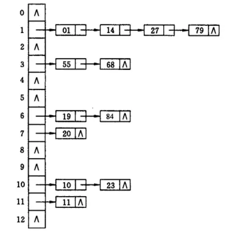
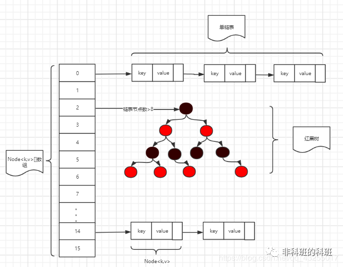
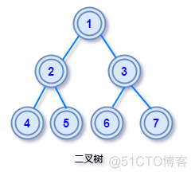
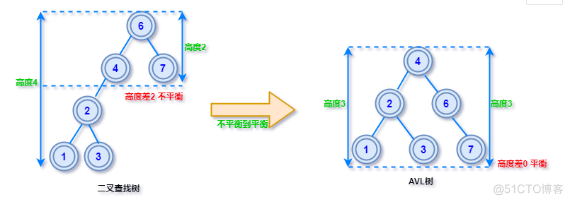
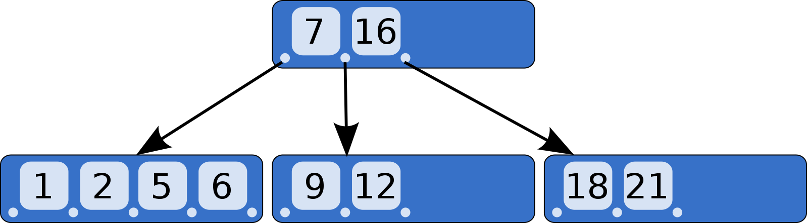
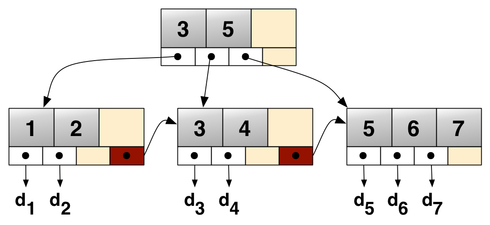

# HashMap
## 1.为什么JDK 7使用数组+链表？JDK8中为什么要使用红黑树？哈希冲突是怎么回事？HashMap又是怎么解决的
> 首先解释一下什么是哈希冲突：hash 叫做 "散列表"。通过散列算法得到固定长度输出。输出结果叫做散列值。但是会在特殊的情况，不同的输入经过散列计算可能得到相同的散列值，此时不能通过散列值来确定唯一值。这种现象称之为 "Hash 冲突"
>
> 接着再来解释目前解决 Hash 冲突的几种方法：
>
>> 1.开放地址法（闭散列）：它的基本原则就是出现冲突后按照一定算法查找一个空位置存放。直到找到为止。开放地址法有三种实现方式：
>>> 线性探测再散列：顺序查看下一个单元，直到找出一个空单元或查遍全表
>>>
>>> 二次(平方)探测再散列：在表的左右进行跳跃式探测，直到找出一个空单元或查遍全表。
>>>
>>> 伪随机探测再散列：建立一个伪随机数发生器，并给一个随机数作为起点
>
>> 2.再哈希法：就是出现冲突后采用其他的哈希函数计算，直到不再冲突为止。
>
>> 3.链接地址法（拉链法）不同与前两种方法，他是在出现冲突的地方存储一个链表，所有的同义词记录都存在其中。形象点说就行像是在出现冲突的地方直接把后续的值摞上去。HashMap 就采用了这种算法。如图：
>> 
>
>> 4.建立公共溢出区：将哈希表分为基本表和溢出表两部分，凡是和基本表发生冲突的元素，一律填入溢出表
>
> 总结四种方式的优缺点：
>> 开放地址法：容易序列化，若可预知数据总数，可以创建完美哈希数列。但是占用空间大，删除节点困难（不能简单地将被删结点的空间置为空，否则将截断在它之后填人散列表的同义词结点的查找路径。这是因为各种开放地址法中，空地址单元(即开放地址)都是查找失败的条件。因此在用开放地址法处理冲突的散列表上执行删除操作，只能在被删结点上做删除标记，而不能真正删除结点。）。
>
>>
>> 再哈希法：节点不易产生聚集。但是增加了计算时间。
>
>> 链接地址法：处理冲突简单，无堆积现象。适合总数经常变化的情况。占空间小。删除结点的操作易于实现。同样也有缺点。查询时效率较低。（存储是动态的，查询时跳转需要更多的时间）。在key-value可以预知，以及没有后续增改操作时候，开放定址法性能优于链地址法。不容易序列化。
>
> 此时就解释了为什么 JDK7 使用数组+链表的存储书数据结构了。就是为了采用链表法解决存储时的哈希冲突。
>
> JDK 为什么在结构上又加了个红黑树？优化查询效率。当出现大量的哈希冲突的时候，HashMap 会变成一张线性表了，这会导致查询效率低下。
> 如图所示：
> 
>
> JDK 8 中为什么要使用红黑树？
>
>> 使用红黑树是为了解决在大量哈希冲突的情况下，线性查询效率低的问题。
> 
> 那为什么偏偏使用了红黑树呢？
>> 
>> 首先了解下数据结构中包含那些常见的"树"：
>>> 1.二叉树：每个节点的度不大于2。即每个节点最多有两个分支。通常称二叉树左右两个分支为左右子树。
>>> 
>>>  
>>>> 二叉树有以下几种：
>>>> 普通二叉树：由一个根节点加上两棵分别称为左子树和右子树组成。
>>>> 
>>>> 满二叉树：二叉树中，叶子节点全都在最底层，除了叶子节点之外，每个节点都有左右两个子节点。
>>>> 完全二叉树：二叉树中，叶子节点都在最底下两层，最后一层的叶子节点都靠左排列，并且除了最后一层，其他层的节点个数都要达到最大。
>>>
>>> 2.二叉查找树（BST）：二叉查找树的要求：
>>>> 若任意节点的左子树不空，则左子树上所有节点的值均小于它的根节点的值；
>>>>
>>>> 若任意节点的右子树不空，则右子树上所有节点的值均大于它的根节点的值；
>>>>
>>>> 任意节点的左、右子树也分别为二叉查找树；
>>>
>>> 
>>> 2.AVL树：AVL 规定任意一个节点对应两颗子树的最大高度差为1，这样的二叉树称为平衡二叉树。
>>> 
>>> 
>>> 
>>> 3.B树：一个 m 阶的B树是一个有以下属性的树
>>>> 1.每一个节点最多有 m 个子节点；
>>>>
>>>> 2.每一个非叶子节点（除根节点）最少有 ⌈m/2⌉ 个子节点；
>>>>
>>>> 3.如果根节点不是叶子节点，那么它至少有两个子节点；
>>>>
>>>> 4.有 k 个子节点的非叶子节点拥有 k − 1 个键；
>>>>
>>>> 5.所有的叶子节点都在同一层
>>> 
>>>
>>> 4.B+树：在B+树中的节点通常被表示为一组有序的元素和子指针。如果此B+树的阶数是m，则除了根之外的每个节点都包含最少 ⌊m/2⌋ 个元素，最多 m-1 个元素，对于任意的结点有最多 m 个子指针。对于所有内部节点，子指针的数目总是比元素的数目多一个。所有叶子都在相同的高度上，叶结点本身按关键字大小从小到大链接。
>>> 
>>>
>>> 5.红黑树：红黑树是每个节点都带有颜色属性的二叉查找树，颜色为红色或黑色。在二叉查找树强制一般要求以外，对于任何有效的红黑树我们增加了如下的额外要求：
>>>>
>>>> 1.节点是红色或黑色；
>>>>
>>>> 2.根是黑色；
>>>>
>>>> 3.所有叶子都是黑色（叶子是NIL节点）。
>>>>
>>>> 4.每个红色节点必须有两个黑色的子节点。（或者说从每个叶子到根的所有路径上不能有两个连续的红色节点。）（或者说不存在两个相邻的红色节点，相邻指两个节点是父子关系。）（或者说红色节点的父节点和子节点均是黑色的。）；
>>>>
>>>> 5.从任一节点到其每个叶子的所有简单路径都包含相同数目的黑色节点；
>>>
>>> 总结：
>>> 为什么不用二叉树，二叉树和 BST 相比，他是无序的，查找效率不如BST。但是由于BST在有序数据插入的时候，如 1、2、3、4 存储结构会变为线性的，导致查询效率降低。因此有了 AVL 树，强制左右子树平衡。虽然避免了线性查询，但是由于其严格平衡的约束，每次插入删除数据都要自旋来调整平衡，严重影响插入，删除效率。于是有了红黑树。红黑树不追求绝对的平衡，因此在在增删的时候不需要每次进行自旋来调整树的平衡，提高了增删效率。
> 
> 通过对树的分析，就可以知道为什么 HashMap 中为什么使用红黑树了。

## 2.hashMap 存储元素流程（JDK8）
> 先了解 HashMap 存储元素过程之后，才能可以更好的理解下面的面试题。
>> 1.计算key的hashCode，并与自己的 hashCode 值右移 16 位进行与运算，计算数据的存储位置；
>>
>> 2.判断 table 数组是否为空或者长度是否等于0：
>>> 如果为空，或者等于0，此时需要进行扩容，调用 resize() 初始化：默认扩容大小为 16，扩容阈值为 12；
>>>
>> 3.扩容初始化完成后，计算落在 hash 桶的位置，如果当前桶为空（没有 hash 冲突），则创建一个 node 节点，放入 table 指定的位置上；
>>
>> 4.如果当前桶有值（有 hash 冲突）：判断 key 是否相等，相等就替换。不等则判断是否是树节点，如果是，则新增树节点。不是树节点则放入链表中。
>>> 判断放入链表后，是否大于链表转树的阈值 8（注意这里的binCount是从0开始的，所以不要认为是7就化树了）。如果大于 8。则化树：`treeifyBin(tab, hash);`；，化树前需要判断数组长度是否大于 64，如果大于则会先扩容，长度大于 64 了才会树化。
>>> 
>>> 如果没有大于 8，则判断插入的节点是否与已有的节点相同，如果相同则跳出此次循环，执行下面的覆盖操作；没有则让 p=e，继续循环；
>> 5.判断此次插入节点是否与已有的节点相等，相等则进行覆盖；
>>
>> 6.判断键值对数量是否大于扩容阈值 12，如果大于则需要扩容 resize()；

## 为什么在解决 hash 冲突的时候，不直接用红黑树？而选择先用链表，再转红黑树?
>> 实现链表长度在小于 8 之前是可以保证性能的。而在大于 8 之后，红黑树搜索时间复杂度是 O(logn)，而链表是 O(n)。此时需要红黑树来加快查询速度，但是新增节点的效率变慢了。因此一开始就使用红黑树无疑是浪费性能的。

## 为什么链表改为红黑树的阈值是 8?
> 因为根据泊松分布计算，理想情况下使用随机的哈希码，容器中节点分布在 hash 桶中的频率遵循泊松分布，按照泊松分布的计算公式计算出了桶中元素个数和概率的对照表，得到结论链表中元素个数为 8 时的节点中途概率已经非常小，再多的就更少了，所以原作者在选择链表元素个数时选择了 8，是根据概率统计而选择的。

## 为什么红黑树退化为链表的时候值为 6？

