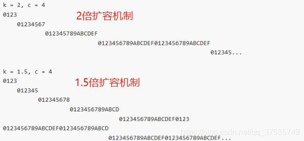

# 集合的作用(为什么要使用集合)

## 使用场景限制：

在程序中，经常会遇到需要一个“容器”来保存程序中需要处理的各种数据类型，这个容器指的就是数组。但是使用数组存储的数据类型比较单一，且长度在声明之后就不会再扩容，同时存放的元素可重复。这些缺点使得数组无法适配程序中各种各样的数据存储场景。因此
Java 产生了集合。

## 使用集合的好处：

从性能上来说集合提高了数据存储的灵活性，还可以动态扩容。 从使用复杂程度来说，Java JDK 中集成了各种集合，并且提供了各种 API 操作接口，更加方便开发使用。

从Java1.5引入了泛型，泛型允许我们为集合提供一个可以容纳的对象类型，不需要使用显式转换和instanceOf操作符，它也给运行时带来好处，因为不会产生类型检查的字节码指令。

# 集合

## 1. Vector与ArrayList

### 不同点：

> 线程安全：
>> Vector：是线程安全的，内部方法使用 synchronized 修饰，并发场景下，效率低下。
>>
>> ArrayList：是非线程安全的。
>
> 扩容：
>> Vector：在原有容量的基础上扩展 1 倍。
>>
>> ArrayList：在原油容量的基础上扩展 0.5 倍。
>>
> 问题1：为什么要成倍的扩容而不是一次增加一个固定大小的容量呢？
>> 一次增加固定值大小复杂度为：O(n)：
>>> 1. 假定有 n 个元素,每次增加k个；
>>> 2. 第i次增加复制的数量为为：ki；
>>> 3. n 次 push_back 操作所花费的时间复杂度为O(n^2)；
>>> 4. 均摊下来每次push_back 操作的时间复杂度为O(n)；
>>>
>>以成倍方式增长复杂度为：O(1)
>>> 1. 假定有 n 个元素,倍增因子为 m;
>>> 2. 完成这 n 个元素往一个 vector 中的 push_back 操作，需要重新分配内存的次数大约为 logm(n);
>>> 3. 第 i 次重新分配将会导致复制 m^(i) (也就是当前的vector.size() 大小)个旧空间中元素;
>>> 4. n 次 push_back 操作所花费的时间复制度为O(n);
>>> 5. m / (m - 1)是一个常量，均摊分析的方法可知，vector 中 push_back 操作的时间复杂度为常量时间;
>>
> 问题1小结：增加固定大小容量，每次 push_back 的操作为 O(n)，以成倍的方式增长，每次 push_back 操作复杂度为 O(1)。因此以成倍的方式扩容。
>
> 问题2：为什么以成倍的方式扩容：
>> 根据大佬们的研究，成倍增长倍数不能太大，这样会导致空间的浪费。所以最好倍增长因子设置为(1,2)之间。另外相较于 2 倍增长，1.5 倍增长在几次扩容之后可以重复使用之前的内容。2 倍增长则不可以。
> > 
---

### Vector 与 ArrayList 相同点

> 数据结构：底层数据结构都是由数组构成，支持索引随机访问数据。
---

## 2. LinkedList 与 ArrayList

### 1.不同点

> 数据结构：
>> LinkedList：内部使用基于链表的数据结构实现存储，具体实现是一个双向链表。在内存中存储地址并不连续。
>>
>> ArrayList：是基于动态数组的数据结构。在内存中是一块儿连续的存储空间
>
> 查询效率：
>> ArrayList：直接根据索引获取数据；或者根据数据获取索引位置，需要遍历整个数组。
>> 
>> LinkedList：根据指定位置查找元素，需要使用 node 方法前后半段遍历链表；查找元素所在位置，需要遍历整个链表。 
>>> 如果使用 for 循环遍历元素，LinkedList 每次都要进行一次 node(index)，在这个方法中遍历了整个链表，每查找一次就遍历一次。当使用迭代器的时候，则只会在构建迭代器获取第一个节点的时候 `listIterator(0)` 用到了 node(index)，此后获取元素都是直接使用 next() 方法获取元素节点。
>>> ArrayList 则是直接根据下标位置获取元素。
>>>
>> 总结： 所以如果使用 for 循环遍历，ArrayList 查询效率远远高于 LinkedList。使用迭代器的话，二者相差不大。
>
> 插入元素：
>> ArrayList 新增元素有两种情况，一种是直接将元素添加到数组末尾，一种是将元素插入到指定位置：
>>> 如果是添加到数组尾部，则先判断是否需要扩容，然后将元素直接插入到末尾。
>>>
>>> 如果是插入到指定位置，则先判断插入位置是否在合理范围，接着判断是否需要扩容个，然后将该位置以后的元素复制到该位置之后，这是非常耗时的；
> 
>> LinkedList：与 ArrayList 相同，插入到指定位置或者队尾：
>>> 如果是添加到队尾，先将原有尾节点保存到临时变量中，然后创建一个新的节点，如果临时变量的节点为空，则表明链表为空，第一个节点就新插入的节点。否则，将临时变量的 next 节点指向 last。
>>>
>>> 如果是指定位置插入：入股范围合理，且插入位置不是在队列尾部，此时在  `linkBefore(element, node(index))` 会调用 node(index) 方法循环链表，此时数据插入就会慢了。
>>> 
>> 总结：
>>
>> 1.因此当在所有元素从头部插入，LinkedList 效率要高于 ArrayList。因为 ArrayList 需要复制数组。
>>
>> 2.如果是从中间位置，ArrayList 插入效率远远高于 LinkedList。因为 LinkedList 需要遍历链表，以及改变引用关系。虽然 ArrayList 在中间位置插入仍然需要复制数组，但这个花费代价可能没有每次遍历花费的代价高。
>>
>> 3.如果是从尾部插入，两者效率差不多。因为 ArrayList 还涉及到扩容，如果不涉及扩容的话，ArrayList 效率要高于 LinkedList。因为前者不用新建节点和改变引用关系。
>>
> 删除元素：
>
>> ArrayList：删除元素有两种方式：
>>
>> 1.一种是直接删除元素，先遍历数组，找到元素对应的索引然后删除。
>> 
>> 2.另一种是直接根据索引删除元素
>>
>> 但是两种方式最终移除元素的逻辑的都是一样。只要移除的元素不是最后一个，都需要对原有数组进行重组。
> 
> LinkedList：删除元素有四种常用的方式：
> 
>> 1.删除指定位置上的元素：`remove(int)`：先检查索引，在遍历链表，找到对应节点之后，通过更新引用 `unlink(Node)`来删除节点。
>>
>> 2.`remove(Object)`：直接删除元素：同样需要遍历链表，找到对应节点通过更改应用关系进行删除。
>>
>> 3.删除第一个节点：直接将第二个节点更改为第一个节点即可。
>>
>> 4.删除尾节点：直接将倒数第二个节点更新为最后一个节点即可。
> 
> 总结：
> 
>> 1.从集合头部删除元素时，ArrayList 花费的时间比 LinkedList 多很多；
>>
>> 2.从集合中间位置删除元素时，ArrayList 花费的时间比 LinkedList 少很多； 
>>
>> 3.从集合尾部删除元素时，ArrayList 花费的时间比 LinkedList 少一点。
---

## 3. Hashtable 与 HashMap

### 1.不同点：

> 线程安全：
>> Hashtable：是线程安全的，内部方法使用 synchronized 修饰并发，并并发场景下，效率低下。
>>
>> HashMap：非线程安全。
>
> 是否可以使用null作为key、value
>> Hashtable：key 和 value 都不能为 null。key 不能为 null 是因为在 Hashtable 中需要利用 key 做 hash 运算。而当 value 值为 null 的情况下，则直接抛出异常。
>>
>> HashMap：key 和 value 的值都可以为 null。HashMap 在处理 key 为 null 的时候，会默认其 hashCode 值为 0。同时对 value 值为 null 的情况也没有校验。
>
> 扩容：
>> Hashtable：默认初始容量为 11，加载因子为 0.75。每次扩容为原油容量的两倍 + 1。
> > HashMap：默认初始容量为 16，加载因子为 0。75。每次扩容为 2^n 次幂。
>>> 将扩容计算方式改为2^n 次幂有以下几个方面的考虑：
>>>
>>> 1.提高运算效率：在计算机中 '&' 运算效率要高于 '%' 取余操作。(详见 HashMap 理解)
>>>
>>> 2.减少 hash 冲突。(为什么可以减少hash冲突详见 HashMap 理解)
>>>
>>> 3.提高空间利用率(2倍扩容是大佬们研究出来的)
>
> Hash 值的计算、索引的计算：
>> Hashtable：Hashtable 直接使用 key 的 hashCode 值。在求 hash 值对应的位置索引时，用取模运算，
> > HashMap：HashMap 重新计算了 key 的HashCode。在求位置索引时，使用与运算。
>
> 底层数据结构：
>> Hashtable：数组 + 链表
>>
>> HashMap：数组 + 链表。1.7 之后，变成了 数组+链表+红黑树
---

### 2.相同点

> 底层数据结构：
>> HashMap 在 1.7 及以前底层数据结构和Hashtable一样，都是 数组+链表
>>
> 存储：
>> 都是基于键值对（K-V）的散列表。采用拉链法实现。 